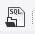

#### Importiranje na podatocite

0. Simni gi [podatocite](https://drive.google.com/open?id=11aOoCF7fOtp0IFHhGwafvCVD5X3BCH9V)
1. Otvori MySQL Workbench i klikni  
2. Odberi `schema.sql` i klikni 
3. Ke treba da si se kreira shemata.. ako ne ja gleas napraj refresh
4. Povtori 2 i 3 no mesto `schema.sql` odberi `data.sql`
5. Refresh
6. Proveri dali e se ok

#### Startuvanje na proekto
1. Otvori intellij i napraj clone
2. Klikni File &rarr; Settings &rarr; Plugins &rarr; Browse repostitories &rarr; Lombok &rarr; Download and restart
3. Valjda ke saka da se pusti vaka ..

#### Dodatno info
- Apito ima vise za dodavanje na se so treba da se dodava so znaci ni treba samo UI
- Treba da smislime kao ke mu kazeme od kaj ni se podatocite
- Ako sakas da testiras post metodi t.e. dodavanje neso moes so postman si raboti

:beers: :punch:	

